## ChampionChecker - Digitalisierung des Sportfests der BBSOVG Magdeburg

### Überblick

**[ChampionChecker](https://championchecker-bbsovg.azurewebsites.net/ChampionChecker.UI/MVC/View/home.php)** ist eine digitale Lösung zur Organisation und Auswertung des jährlichen Sportfests der BBSOVG Magdeburg. Die Anwendung ersetzt den bisherigen papierbasierten Prozess durch eine moderne Webanwendung, die eine effizientere Organisation, Echtzeit-Auswertung und bessere Zusammenarbeit zwischen Lehrkräften und Wettkampfleitern ermöglicht.

---

### 🎯 Motivation

Bisher erfolgte die gesamte Organisation des Sportfests auf Papier, was zahlreiche Probleme verursachte:

❌ **Langwierige Organisation**
- Verwaltung von Schülern, Lehrern und Stationen auf dutzenden Zetteln.
- Schwieriger Überblick über Anmeldungen und Zeitkonflikte.
- Änderungen mussten umständlich kommuniziert werden und dauerten lange.

❌ **Kein Live-Tracking**
- Ergebnisse waren erst nach Ende des Wettbewerbs verfügbar.
- Während des Sportfests gab es keine Echtzeit-Einsicht in den aktuellen Stand.

❌ **Fehleranfällige Auswertung**
- Punktzahlen wurden manuell berechnet, was fehleranfällig und zeitintensiv war.
- Fehlerhaft eingetragene Ergebnisse waren nur aufwendig änderbar.

---

### 🚀 Vorteile der digitalen Lösung

Mit **ChampionChecker** wird das Sportfest einfacher, schneller und transparenter:

✅ **Live-Tracking & Auswertung**
- Zwischenstände sind in Echtzeit einsehbar ➜ Mehr Spannung & Motivation für alle Teilnehmer.
- Automatische Punkteberechnung basierend auf den eingetragenen Ergebnissen.
- Ergebnisse können mühelos korrigiert werden.

✅ **Effiziente Anmeldung & Verwaltung**
- Schüler- und Lehrerdaten lassen sich per CSV-Import schnell hinzufügen.
- Alle Informationen der Schüler, Lehrer und Stationen sind für authentifizierte Nutzer auf einen Blick sichtbar.
- Einfache Kollaboration zwischen Lehrkräften und Wettkampfleitung.

✅ **Bessere Planung & Steuerung**
- Lehrkräfte, Schüler und Stationen können effizienter koordiniert werden.
- Automatische Erkennung von Zeitkonflikten bei Schülerstationen für eine bessere Planung.
- Flexible Anpassung der Stationsplanung jederzeit möglich.

---

## 🚀 Schnellstart

### 🔹 Zugriff für Gäste

Ohne Anmeldung können Sie:
- Den aktuellen Stand der Auswertung verfolgen
- Anstehende Stationen einsehen
- Ergebnisse der einzelnen Klassen abrufen

### 🔹 Anmeldung & Benutzerrollen

Um Daten zu ändern oder geschützte Informationen zu sehen, ist eine Anmeldung erforderlich. Es gibt folgende Rollen:
- Gast 🏁 → Kann Klassen-Ergebnisse und Auswertungsstand einsehen.
- Schüler 🎓 → Eingeloggter Nutzer
- Lehrkraft 🏫 → Kann zusätzlich zur allgemeinen Übersicht:
  - Alle Klassen- und Schüler-Ergebnisse einsehen
  - Neue Klassen- und Schüler-Ergebnisse eintragen
  - Die Schülerübersicht abrufen und neue Schüler anlegen
  - Die Stationenübersicht einsehen und dort Teilnehmer setzen
- Admin ⚙️ → Hat vollen Zugriff und kann alle Daten inklusive Lehrkräfte verwalten, bearbeiten und anpassen.

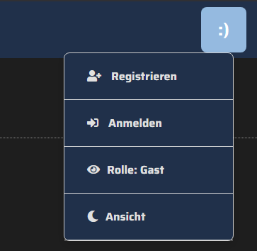

---

## Anwendungsaufbau

### Auswertung
- Anzeige des Auswertungsfortschritts und der aktuellen Platzierungen 
- Anzeige der anstehenden Wettbewerbe
  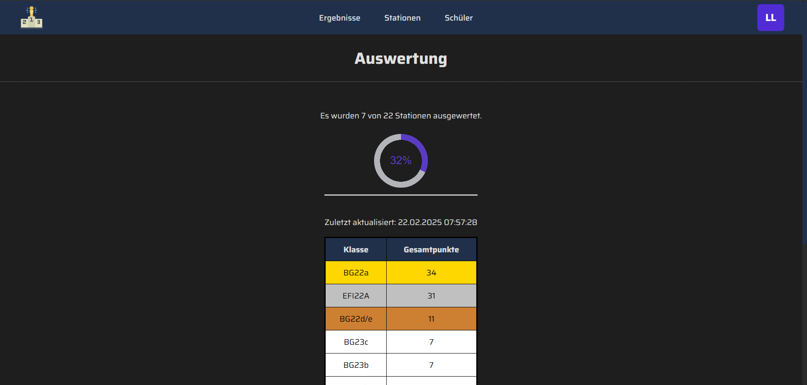

---

### Ergebnisse ansehen
- Auf der Ergebnisseite werden alle Klassenergebnisse angezeigt. Lehrkräfte und Admins können zusätzlich Schüler-Ergebnisse einsehen
- Admins können die Klassen- und Schülerergebnisse bearbeiten durch Klick auf den blauen Bearbeitungsbutton.
  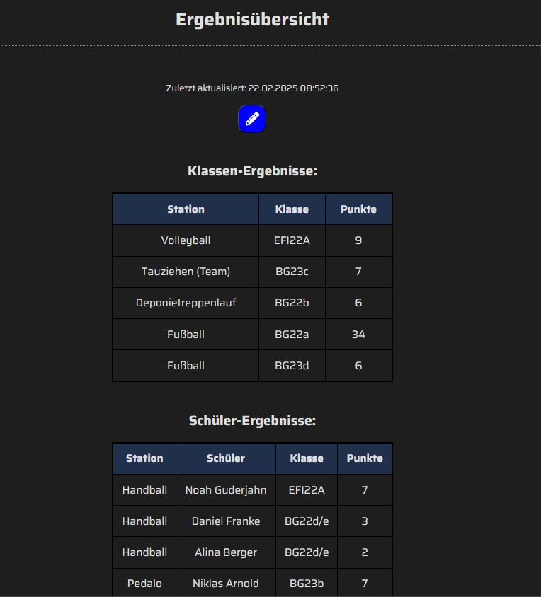

---

### Klassenergebnisse hinzufügen
- Nach Auswahl der Station werden alle teilnehmenden Klassen der Station angezeigt. Stationen ohne Klassen sind deaktiviert.
- Um ein Ergebnis hinzuzufügen wählen Sie die jeweilige Klasse aus und geben Sie die erreichte Punktzahl ein.
  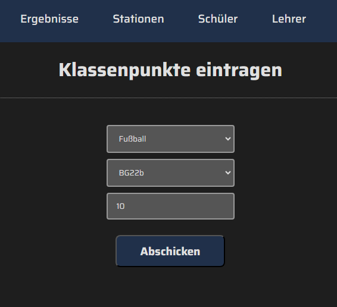

---

### Einzelergebnisse hinzufügen
- Bei Auswahl einer Station werden Stations-Infos angezeigt
  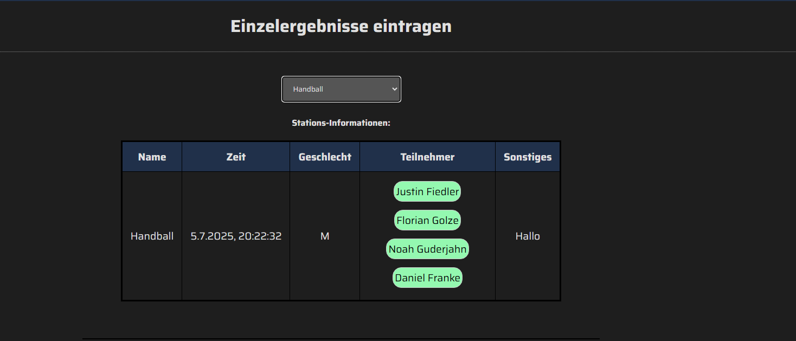

- Die Anzahl der Versuche pro Schüler und die Mess-Einheit ist flexibel konfigurierbar
- Bei Eingabe eines Werts wird der beste Schüler-Versuch automatisch ermittelt und hervorgehoben. Die Auswertung wird automatisch berechnet und bei Änderungen aktualisiert.
- Bei Klick auf den "Station abschließen"-Button wird ein Hinweis angezeigt, dass die Vollständigkeit der Ergebnisse bestätigt werden soll
- Erfolgreich ausgewertete Einzelstationen werden automatisch in der Stationenverwaltung auf "Beendet" gesetzt, wodurch der Auswertungsfortschritt direkt aktualisiert wird
  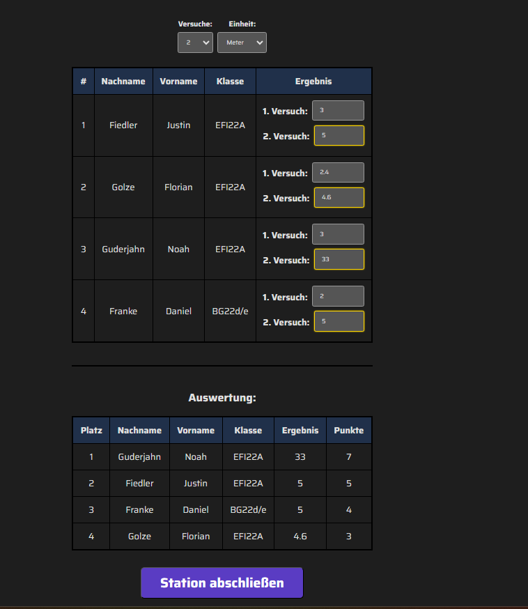

---

### Stationenverwaltung
- Hier werden alle Informationen über die Stationen angezeigt
- Bei Teamstationen werden die Klassennamen angezeigt, bei Einzelstationen die Schülernamen
- Admins haben volle Bearbeitungsrechte, Lehrkräfte können Teilnehmer, Status und sonstige Notizen bearbeiten
- Um eine Station zu bearbeiten klicken Sie auf den blauen Bearbeitungsbutton
  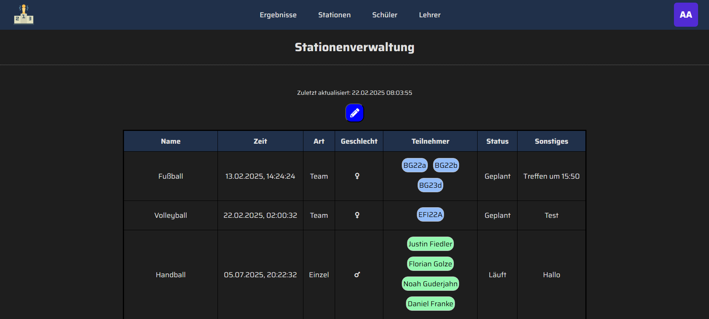
  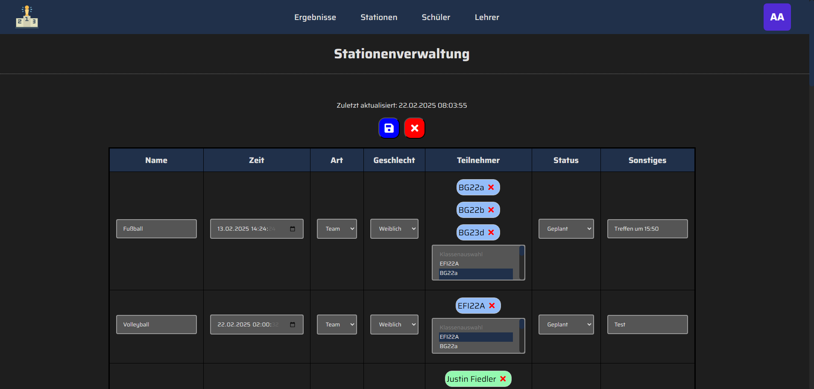

---

### Schülerübersicht
- Auflistung aller Schüler
- Hinweis für Schüler mit zu wenigen Stationen (weißes "!")
- Hinweis auf Zeitkonflikte bei Schüler-Stationen (rotes "!")
- Information über Anmeldungsstand der Schüler (Zwischenstand oder offiziell)
- Neue Schüler können über das "+" hinzugefügt werden (CSV-Import)
  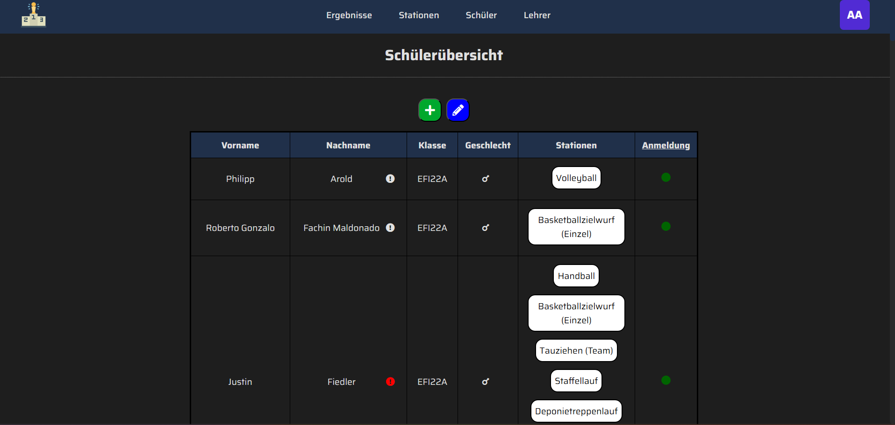

---

### Schüler CSV-Import
- Schüler lassen sich bequem über eine CSV-Datei ins System bringen
- Anforderung an das CSV-Format wird im Import-Dialog angezeigt
- Vorschau über zu importierende Schüler, Import bei Klick auf den Button
  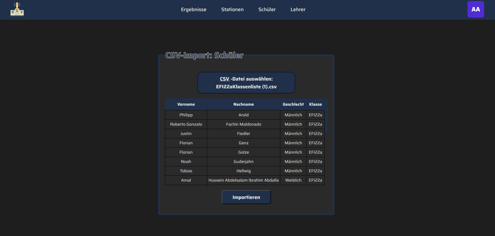

---

### Lehrerverwaltung
- Zugriff nur für Administratoren
- Überblick über alle Lehrkräfte und deren Teilnahme am Sportfest
  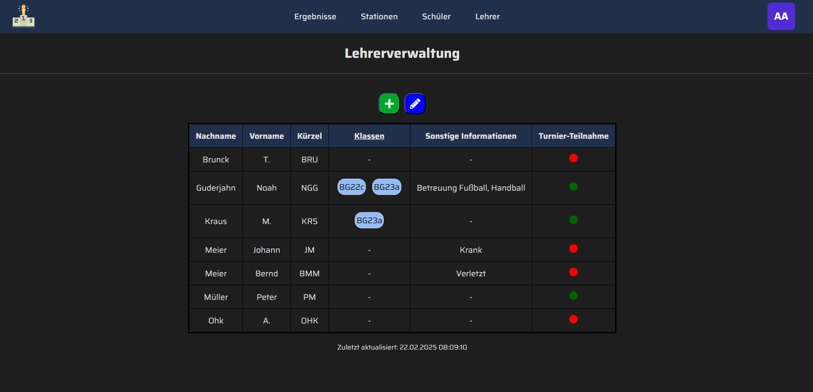
- Neue Lehrer hinzufügen: Auswahl zwischen manueller Erstellung und CSV-Import analog zu Schüler-CSV-Import
- Bei aktiver Teilnahme können dem Lehrer zwei Klassen zugewiesen werden
  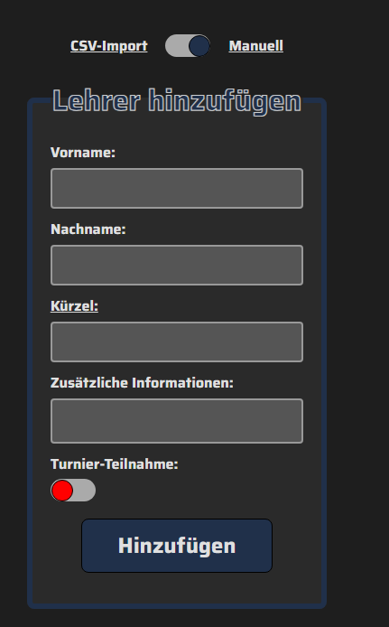

---

### Ansichtsmodus
- Die Anwendung bietet einen Hell- und Dunkelmodus an, der flexibel umgeschaltet werden kann
  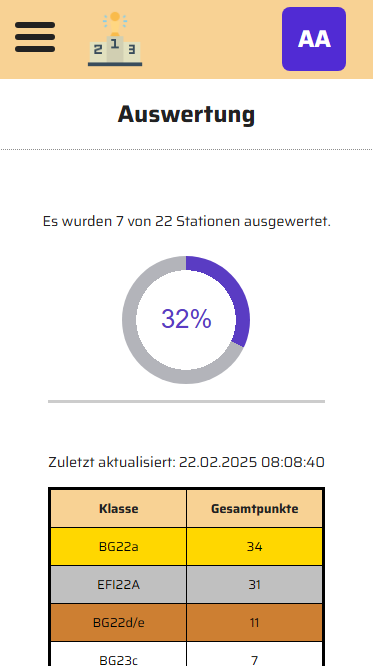
  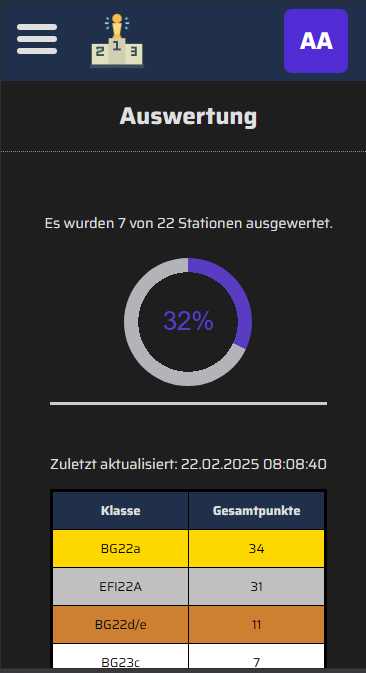

- [Dynamischer Wechsel des Ansichtsmodus](resources/documentation-images/championchecker-view.mp4)

---

